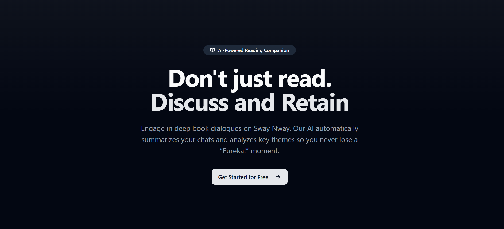
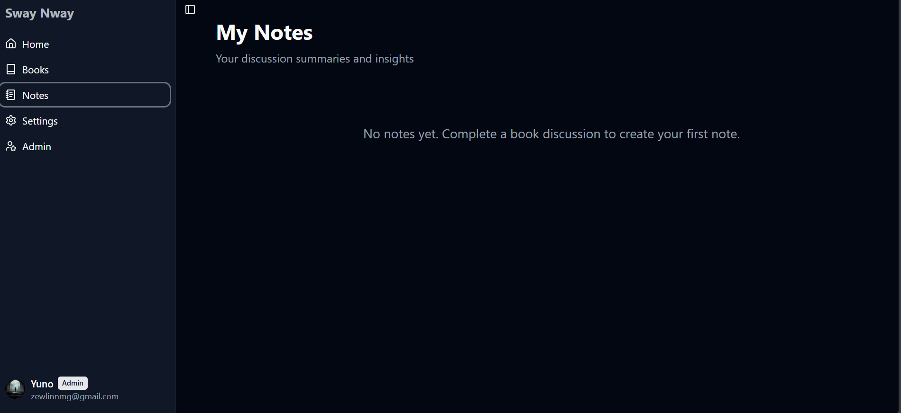
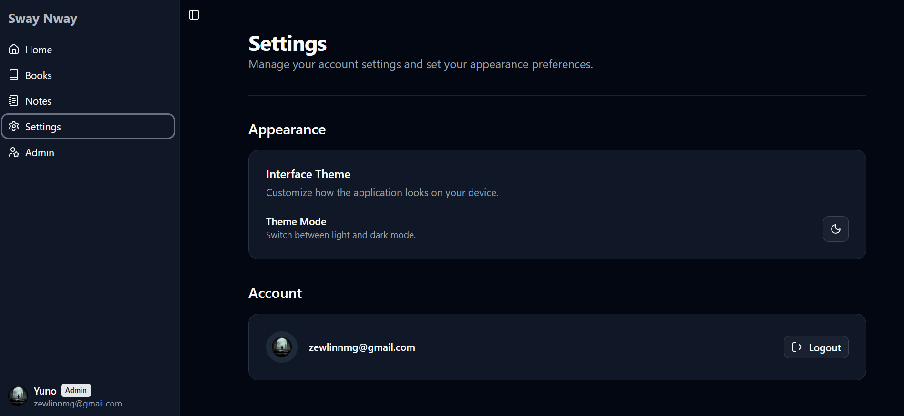

# 🚀 Sway-Nway

<div align="center">

[](https://github.com/ZweLinn/Sway-Nway/stargazers)
[](https://github.com/ZweLinn/Sway-Nway/network)
[](https://github.com/ZweLinn/Sway-Nway/issues)
[](LICENSE)

**An AI-powered book discussion platform built with modern web technologies.**

[Live Demo](https://swaynway.site) | [GitHub Repository](https://github.com/ZweLinn/Sway-Nway)

</div>

## 📖 Overview

Sway-Nway is an innovative web application designed to foster engaging discussions around books using the power of Artificial Intelligence. It provides a dynamic platform where users can explore various books, participate in threaded discussions, and leverage AI to gain deeper insights or facilitate conversations. Built with a full-stack Next.js architecture, Sway-Nway offers a modern user experience backed by a robust and scalable backend.

## ✨ Features

-   **AI-Powered Insights:** Leverage Google Gemini to generate summaries, discuss plot points, or answer questions about books, enhancing the depth of conversations.
-   **Interactive Discussion Forums:** Create and participate in threaded discussions for individual books, fostering a vibrant community.
-   **Book Management:** Explore a curated collection of books and manage personal reading lists.
-   **User Authentication & Profiles:** Secure user registration via Google and GitHub, with personalized profiles.
-   **Multilingual Support:** Engaging discussions in both English and Burmese (Myanmar).
-   **Responsive Design:** A seamless experience across all devices, from desktop to mobile.
-   **Modern & Accessible UI:** Beautifully crafted user interface utilizing Radix UI, Shadcn UI, and Tailwind CSS 4.
-   **Robust Data Persistence:** Reliable storage and management of application data using PostgreSQL and Prisma ORM.

## 🖥️ Screenshots






## 🛠️ Tech Stack

**Frontend:**


**Backend:**


**Database:**


**Dev Tools:**


## 🚀 Quick Start

Follow these steps to get Sway-Nway up and running on your local machine.

### Prerequisites
Before you begin, ensure you have the following installed:
-   **Node.js**: v18.x or higher (recommended LTS v20.x)
-   **pnpm**: (recommended package manager)
-   **PostgreSQL**: A running instance of PostgreSQL.

### Installation

1.  **Clone the repository**
    ```bash
    git clone https://github.com/ZweLinn/Sway-Nway.git
    cd Sway-Nway
    ```

2.  **Install dependencies**
    ```bash
    pnpm install
    ```

3.  **Environment setup**
    Create a `.env` file by copying the provided example:
    ```bash
    cp .env.example .env
    ```
    Open `.env` and configure your environment variables (see [Configuration](#-configuration)).

4.  **Database setup**
    Ensure your PostgreSQL database is running. Then, apply Prisma schema and generate the client:
    ```bash
    pnpm prisma db push
    pnpm prisma generate
    ```

5.  **Start development server**
    ```bash
    pnpm dev
    ```

6.  **Open your browser**
    Visit `http://localhost:3000`.

## 📁 Project Structure

```
Sway-Nway/
├── prisma/                 # Prisma schema and migrations
│   └── schema.prisma       # Database schema definition
├── public/                 # Static assets (images, favicon, etc.)
│   └── images/             # Screenshot and assets
├── scripts/                # Utility scripts (e.g., promote-admin.mjs)
├── src/                    # Main application source code
│   ├── app/                # Next.js App Router (pages and API routes)
│   │   ├── (dashboard)/    # Authenticated dashboard routes
│   │   ├── api/            # API Endpoints (chat, books, discussions)
│   │   └── auth/           # Custom auth pages
│   ├── components/         # Reusable React components
│   │   ├── ui/             # Shadcn UI base components
│   │   └── chat/           # Feature-specific components
│   ├── lib/                # Shared utilities and Prisma client
│   ├── hooks/              # Custom React hooks
│   └── types/              # TypeScript definitions
├── next.config.ts          # Next.js configuration
├── package.json            # Project dependencies and scripts
└── tsconfig.json           # TypeScript configuration
```

## ⚙️ Configuration

### Environment Variables
Configure these variables in your `.env` file:

| Variable                     | Description                                   | Required |
|------------------------------|-----------------------------------------------|----------|
| `DATABASE_URL`               | Connection string for PostgreSQL              | Yes      |
| `GOOGLE_GENERATIVE_AI_API_KEY` | API key for Google Gemini AI                | Yes      |
| `GOOGLE_CLIENT_ID`           | Google OAuth Client ID                        | Yes      |
| `GOOGLE_CLIENT_SECRET`       | Google OAuth Client Secret                    | Yes      |
| `GITHUB_CLIENT_ID`           | GitHub OAuth Client ID                        | Yes      |
| `GITHUB_CLIENT_SECRET`       | GitHub OAuth Client Secret                    | Yes      |
| `NEXTAUTH_SECRET`            | Secret for NextAuth.js JWT encryption         | Yes      |
| `NEXTAUTH_URL`               | The canonical URL of your application         | Yes (Prod)|

## 🔧 Development

### Available Scripts
| Command           | Description                                       |
|-------------------|---------------------------------------------------|
| `pnpm dev`        | Starts the development server at `localhost:3000`.|
| `pnpm build`      | Creates a production-ready build.                 |
| `pnpm start`      | Starts the production server.                     |
| `pnpm lint`       | Runs ESLint checks.                               |
| `pnpm prisma db push` | Pushes the Prisma schema to the database.     |
| `pnpm prisma generate` | Generates the Prisma client.                  |

## 🚀 Deployment

The easiest way to deploy Sway-Nway is via [Vercel](https://vercel.com/), which provides native support for Next.js, including serverless functions for the API and AI streaming.

## 🤝 Contributing

We welcome contributions! Please fork the repository, create a feature branch, and submit a pull request.

## 📄 License

This project is licensed under the [MIT License](LICENSE).

## 🙏 Acknowledgments

-   Built with [Next.js](https://nextjs.org/) and [React 19](https://react.dev/).
-   AI capabilities powered by [Google Gemini](https://ai.google.dev/) and [Vercel AI SDK](https://sdk.vercel.ai/).
-   Database management via [Prisma ORM](https://www.prisma.io/).
-   UI Components from [Radix UI](https://www.radix-ui.com/) and [Shadcn UI](https://ui.shadcn.com/).

---

<div align="center">

**⭐ Star this repo if you find it helpful!**

Made with ❤️ by [ZweLinn](https://github.com/ZweLinn)

</div>
